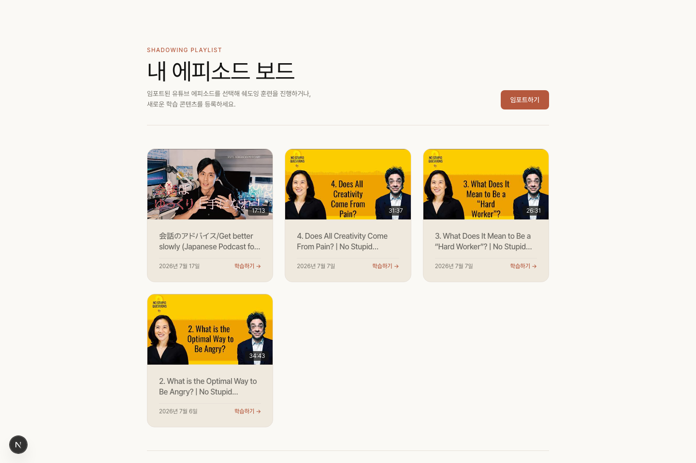
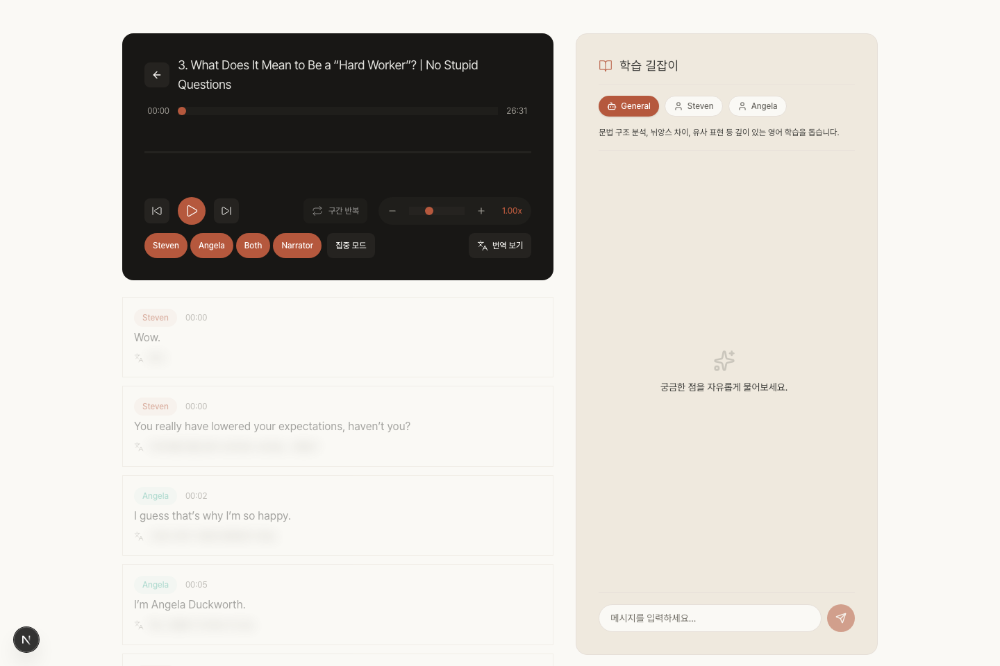
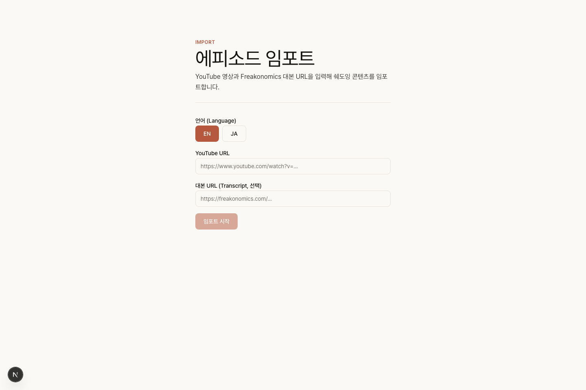
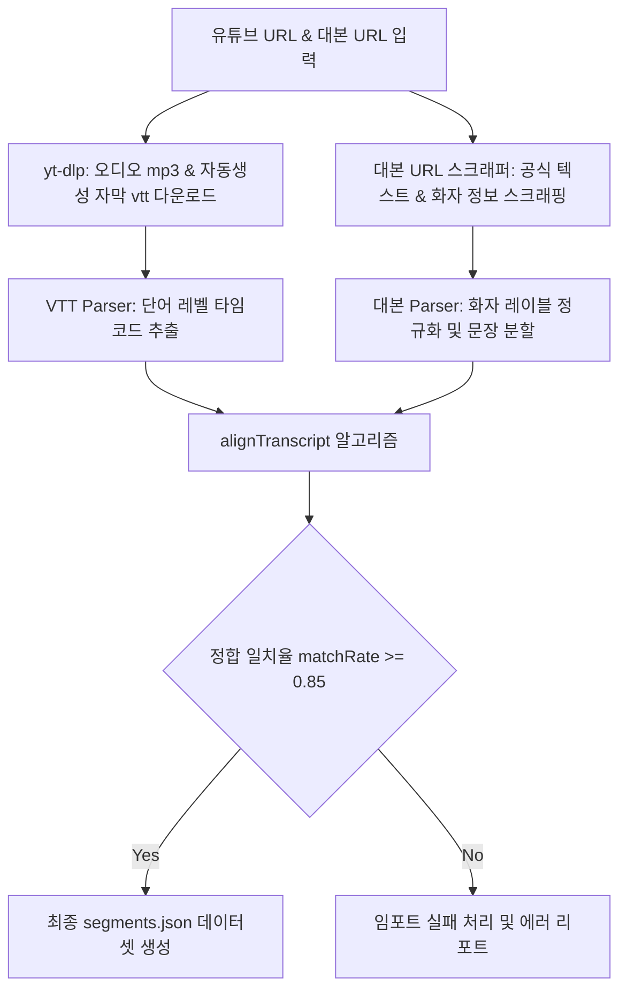
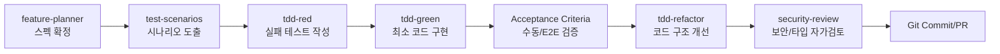

# NSQ (No Stupid Questions) Shadowing

> Freakonomics 공식 대본 기반 고품질 화자 분리형 영어 쉐도잉 웹 애플리케이션

공식 스크립트와 유튜브 오디오/자막의 시간축을 정렬(Alignment)하여, 고품질 화자 분리 쉐도잉 환경 및 AI 피드백을 제공하는 Next.js 기반 학습 도구입니다.

---

## 1. 주요 화면 예시 (Screenshots)

### 1.1 에피소드 대시보드 (Episode Dashboard)

가져온 에피소드 목록을 관리합니다. 장시간 가독성을 위해 크림톤 캔버스와 세리프 서체를 적용한 Warm-canvas 디자인을 채택했습니다.


### 1.2 쉐도잉 플레이어 (Shadowing Player)

문장 단위 반복 재생(A-B Repeat), 화자 필터링, 배속 조절, 오디오 파형 시각화, 음성 녹음 및 AI 피드백(튜터 채팅)을 제공하는 핵심 학습 화면입니다.


### 1.3 에피소드 임포트 (Episode Import)

유튜브 URL과 Freakonomics 대본 URL을 받아 오디오/자막 추출, 대본 스크래핑, 텍스트 정합(Alignment), 번역 처리를 수행하는 파이프라인 제어기입니다.


---

## 2. 기획 의도 및 핵심 가치 (Product Focus)

### 2.1 학습 대상자 정의

- Freakonomics의 **'No Stupid Questions'** 팟캐스트를 통해 실제 영어 원어민의 자연스러운 대화체 표현을 학습하고자 하는 중·고급 영어 학습자.

### 2.2 해결하고자 하는 문제

- **유튜브 자막의 한계**: 문장 부호 누락 및 화자 분리 불가 문제를 **공식 대본(Ground Truth)**과의 매핑으로 정교화하여 해결합니다.
- **장시간 학습 피로**: 차가운 네온/어두운 테마 대신 아날로그 인쇄물 질감의 크림색 배경(Warm-canvas)과 세리프 서체를 도입해 인지 피로를 낮췄습니다.

---

## 3. 핵심 기술 아키텍처 (Technical Architecture)

### 3.1 처리 파이프라인 (Transcript-Guided Segmentation)

유튜브 자막의 단어 레벨 타임스탬프와 공식 대본을 병합하기 위해 자체적인 정합 엔진을 구축하였습니다.



### 3.2 정합 세그먼트 데이터 구조

파이프라인을 거쳐 정합이 완료되면 로컬 디렉토리 `.shadowing/episodes/{videoId}/` 하위에 다음과 같이 정합된 데이터셋이 영속화됩니다.

```json
[
  {
    "index": 0,
    "speaker": "Angela",
    "start": 64.28,
    "end": 70.246,
    "text": "Stephen, I have a personal question for you, and I want you to be honest. Are you a hard worker?",
    "translation": "스티븐, 개인적인 질문이 있어요. 솔직하게 대답해주세요. 당신은 열심히 일하는 사람인가요?"
  }
]
```

---

## 4. 핵심 기술적 도전 및 해결 방안 (Technical Challenges & Solutions)

### 4.1 Patience-Diff 기반 최장 증가 부분수열(LIS) 정합 알고리즘

- **문제**: 유튜브 자동 자막과 공식 대본 간 오탈자, 생략어 등으로 단순 문자열 매칭 시 싱크가 밀리는 현상 발생.
- **해결**: 양쪽 텍스트에서 유일한 고유 단어들을 앵커(Anchor)로 설정하는 **Patience-Diff** 방식을 적용했습니다. 앵커의 최장 증가 부분수열(LIS)을 구해 기준선을 확정하고, 구간 내 세부 매칭 및 선형 보간으로 오차를 보정합니다. (코드: [alignTranscript.ts](file:///Users/zorba/projects/nsq/src/lib/alignTranscript.ts))
- **예외 처리**: 최종 일치율(`matchRate`)이 85% 미만일 경우 정합 품질 미달로 판단하여 임포트를 취소합니다.

### 4.2 오디오 경계 Back-off 기법

- **문제**: HTML5 Audio API로 세그먼트 시작 지점 기동 시, 기기 디코더 오차 및 브라우저 성능에 의해 첫 음절이 누락되거나 직전 세그먼트 끝자락이 혼입되는 경계면 노이즈 발생.
- **해결**: 세그먼트 전환 오동작을 방지하기 위해 시작 타임스탬프보다 **0.05초(50ms) 먼저 재생을 시작하는 Back-off 보정 로직**을 적용해 청취 끊김을 해소했습니다.

### 4.3 UI 중첩 스타일링 제거 (Seamless Nesting)

- **문제**: 카드 및 리스트 내부에 자식 컴포넌트가 결합될 때 외곽선(border)과 배경색이 중복되어 레이아웃이 조잡해지는 문제.
- **해결**: 부모의 영역 속성에 맞춰 자식의 border와 bg-color를 제거하는 `Seamless Nesting` 설계를 적용하여 투명하게 스며드는 시각 구조를 유지했습니다. (디자인 시스템: [DESIGN.md](file:///Users/zorba/projects/nsq/docs/design-system/DESIGN.md))

### 4.4 TDD 기반의 점진적 개발 체계

- **문제**: 미세 타이밍 제어 및 파싱 알고리즘의 복잡성으로 인해 기능 추가 시 미치는 영향 범위(Side effect) 추적이 어려움.
- **해결**: `Vitest`로 `alignTranscript` 등의 핵심 정합 엔진의 단위 테스트를 확보했으며, `Playwright` 기반 E2E 시나리오를 가동하여 임포트 및 반복 재생 기능의 정상 작동을 완벽히 격리 검증했습니다.

---

## 5. 개발 프로세스 및 품질 보증 (Development Process & QA)

### 5.1 docs/features 기반의 점진적 요구사항 파편화 및 Issue 트래킹

- **이슈 중심 개발**: 신규 기능 구현 전, `docs/features/{기능명}/` 디렉토리 하위에 PRD(제품 요구사항 정의서) 및 상세 기술 설계(Tech Spec)를 수직 슬라이싱(Vertical Slicing) 형태로 선행 정의했습니다.
- **GitHub Issue 연동**: 정의된 기능 및 스펙 단위는 전부 GitHub Issue로 변환/매핑하여 마일스톤별 진행률을 시각화하고, 개발 전체 이력을 투명하게 추적 관리했습니다.

### 5.2 AI 에이전트 협업 TDD 워크플로우 (AI-Assisted Development Loop)

프로젝트의 높은 비즈니스 신뢰성을 담보하기 위해 정교한 AI 에이전트 스킬 루프와 TDD 방식을 결합한 하이브리드 워크플로우를 가동했습니다.



- **에이전트 스킬 루프**: 기획 분석 및 작업 분해(`feature-planner`) ➔ 테스트 시그니처 설계(`test-scenarios`) ➔ 실패 테스트 생성(`tdd-red`) ➔ 통과 코드 구현(`tdd-green`) ➔ 리팩토링(`tdd-refactor`) ➔ 타입·보안 자가 점검(`security-review`)의 7단계 루프를 엄격히 작동시켰습니다.
- **인간 개발자 검증 게이트**: 테스트 통과 여부와 별개로 각 단계마다 인간 개발자의 AC(인수 조건) 검증 승인 단계를 거치도록 게이트를 배치하여 코드 완성도를 확보했습니다.

### 5.3 Husky & Lint-Staged 기반 자동 검증 (Git Hooks 통제)

- **품질 강제**: Git Hook 제어 도구인 `Husky`를 사용하여 커밋(Commit) 및 푸시(Push) 시점에 코드 스타일 및 정적 분석 오류가 자동으로 차단되도록 방어벽을 세웠습니다.
- **최적화된 검증**: `lint-staged` 환경을 구성해 변경된 코드 파일에 대해서만 ESLint 정적 분석, Prettier 코드 포맷 정렬을 강제 수행하여 유지보수에 적합한 고품질 코드 상태를 일정하게 유지했습니다.

---

## 6. 기술 스택 (Tech Stack)

### Frontend

- **Framework**: Next.js (App Router, version 16)
- **Styling**: Tailwind CSS v4, PostCSS, class-variance-authority, clsx
- **Icons**: Lucide React
- **Text Rendering**: React Markdown, Node HTML Parser

### Backend & AI Integration

- **Runtime**: Next.js API Routes (Route Handlers)
- **Script Processing**: `yt-dlp` CLI 연동 (오디오 및 자막 스트리밍 다운로드)
- **AI Service**: OpenRouter AI SDK, Vercel AI SDK (Angela/Stephen 튜터 챗봇)

### Storage & Dev Tools

- **Asset Storage**: Cloudflare R2 / AWS S3 SDK
- **Testing**: Vitest, Playwright (E2E), Testing Library
- **Linting & Quality**: ESLint, Prettier, Husky, lint-staged, Commitlint

---

## 7. 프로젝트 디렉토리 구조 (Project Structure)

```
nsq/
├── docs/                          # 프로젝트 문서 및 디자인 가이드
│   ├── design-system/             # Warm-canvas 색상, 타이포그래피, 컴포넌트 명세
│   └── features/                  # 피처별 기획서(PRD) 및 기술 설계
├── e2e/                           # Playwright E2E 통합 테스트 코드
├── public/
│   ├── episodes/                  # 에피소드 캐시 인덱스 리스트 (index.json)
│   └── screenshots/               # README 포함용 캡처 이미지
├── src/
│   ├── app/                       # Next.js App Router (Page, API Routes)
│   │   ├── api/                   # 에피소드 CRUD, 임포트, AI 튜터 API
│   │   ├── episodes/              # 쉐도잉 플레이어 화면 (/episodes/[id])
│   │   └── import/                # 임포트 전용 화면
│   ├── components/                # UI 공통 및 도메인별 리액트 컴포넌트
│   │   ├── common/                # Button, Card, Badge 등 공통 컴포넌트
│   │   └── episode/               # 대시보드 리스트, 플레이어 메인 뷰
│   ├── hooks/                     # Custom React Hooks (Audio, Recorder 등)
│   ├── lib/                       # 도메인 비즈니스 및 유틸리티 로직
│   │   ├── alignTranscript.ts     # 핵심 정합 알고리즘
│   │   ├── freakonomics.ts        # 공식 대본 파서
│   │   └── vtt.ts                 # 유튜브 자막 파서
│   └── __tests__/                 # Vitest 단위 테스트 코드
├── CLAUDE.md                      # 프로젝트 정책 및 룰셋 명세
├── PRODUCT.md                     # 프로덕트 정의서
├── package.json                   # 종속성 구성
└── tailwind.config.ts             # Tailwind CSS 설정
```

---

## 8. 실행 및 개발 환경 가이드 (Setup Guide)

### 7.1 필수 사전 설치 소프트웨어

- Node.js v20 이상
- `yt-dlp` (유튜브 미디어 다운로드용, 로컬 터미널 환경에 설치되어 있어야 함)

### 7.2 환경 변수 설정 (`.env.local`)

`.env.example` 파일을 참조하여 프로젝트 루트에 `.env.local` 파일을 생성하고 적절한 API Key를 할당합니다.

```bash
OPENROUTER_API_KEY=your_openrouter_api_key_here
AWS_ACCESS_KEY_ID=your_r2_access_key
AWS_SECRET_ACCESS_KEY=your_r2_secret_key
# ...기타 필요한 로컬 설정값
```

### 7.3 패키지 설치 및 실행

```bash
# 종속성 패키지 설치
npm install

# 로컬 개발 서버 기동
npm run dev

# 단위 테스트 실행 (Vitest)
npm run test

# E2E 테스트 실행 (Playwright)
npm run test:e2e
```
