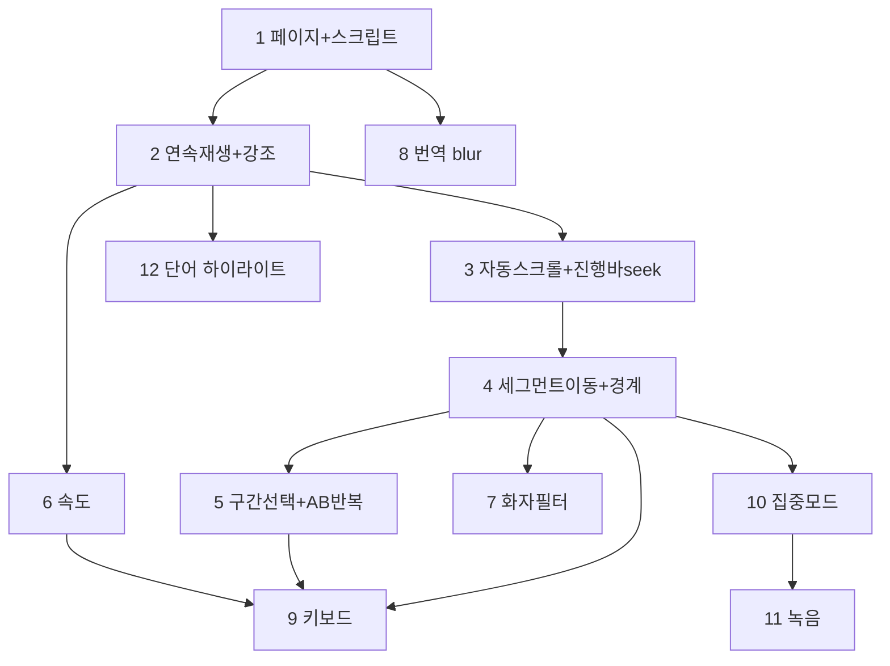

# 쉐도잉 플레이어 MVP — 이슈 분해 (issues.md)

> 기준: [prd.md](./prd.md) / [spec-fixed.md](./spec-fixed.md)
> 원칙: **수직 슬라이싱** — 각 이슈는 완료 즉시 사용자에게 검증 가능한 독립 동작을 제공한다. 순수 유틸(time/audio/recorder/vtt)·단독 API는 별도 이슈로 쪼개지 않고, 처음 필요로 하는 수직 이슈에 흡수한다.
> 의존성: 위 → 아래 순서로 진행(역방향 개발 금지).

---

## Slice 1 — 기본 재생 + 스크립트 뷰

### Issue 1 — 플레이어 페이지 진입 + 화자별 스크립트 정적 렌더

**의존성**: 없음 (기반)
**흡수 유틸**: `utils-time`(`formatTime`)
**범위**:

- [NEW] `GET /api/episodes/[id]/segments` — 기존 `getEpisodeSegments(id)` 래핑 (미존재 404 / 진행중 409 / segments 부재 404)
- [NEW] `src/app/episodes/[id]/page.tsx` (RSC) — `meta`+`Segment[]` 로드, completed·segments 검증, 미충족 시 `redirect('/')`
- [NEW] `src/components/player/ScriptView.tsx` — 세그먼트를 화자 색상(`SPEAKER_COLORS`)·타임코드(`formatTime`)로 정적 렌더
- [NEW] `src/lib/utils/time.ts` — `formatTime`, `parseVttTimecode`
- [NEW] `scripts/seed-episode.ts` — mock 에피소드 시딩(`meta.json`/`import-state.json`(completed)/`segments.json`/`audio.mp3` stub)

**Acceptance Criteria**

- **AC1** — Given completed 에피소드 id, When `/episodes/[id]` 진입, Then 화자별 색상으로 구분된 세그먼트 목록과 각 타임코드(`mm:ss`)가 렌더된다.
- **AC2** — Given 진행중·실패·미존재·segments 부재 에피소드, When 해당 URL로 직접 진입, Then `/`로 리다이렉트된다.
- **AC3** — Given 시딩된 mock 에피소드, When `GET /api/episodes/[id]/segments` 호출, Then 200과 `Segment[]`을 반환한다. (미존재 404 / 진행중 409)

---

### Issue 2 — 오디오 연속 재생 + 현재 세그먼트 강조

**의존성**: Issue 1
**흡수 유틸**: `utils-audio`(`audio.ts` 래퍼 — 1차)
**범위**:

- [NEW] `src/lib/utils/audio.ts` — HTMLAudioElement 래퍼 1차(`play`/`pause`/`getCurrentTime`/`onTimeUpdate`/`onEnded`)
- [NEW] `src/hooks/useShadowingPlayer.ts` — audio manager 소유, `timeupdate`로 `currentSegmentIndex` 산출, 재생/정지 상태
- [NEW] `src/components/player/AudioControls.tsx` — 재생/정지 토글 버튼(1차)
- [MODIFY] `src/components/player/shadowing-player.tsx` — mockup → 동작 Client Component(상단 dark 플레이어 + 하단 스크립트)로 재작성, `useShadowingPlayer` 연결
- [MODIFY] `ScriptView.tsx` — 현재 세그먼트 강조(`React.memo`)

**Acceptance Criteria**

- **AC1** — Given 플레이어 페이지, When ▶를 누르면, Then 오디오가 처음부터 연속 재생되고 경계에서 멈추지 않는다.
- **AC2** — Given 재생 중, When 재생 위치가 다음 세그먼트 구간에 들어가면, Then 해당 세그먼트가 시각적으로 강조된다.
- **AC3** — Given 오디오가 끝까지 재생됨, When `ended` 도달, Then 정지되고 마지막 세그먼트 강조가 유지된다.

---

### Issue 3 — 자동 스크롤 + 진행바 seek

**의존성**: Issue 2
**흡수 유틸**: `utils-audio`(`audio.ts` 래퍼 — seek/duration 확장)
**범위**:

- [MODIFY] `audio.ts` — `seekTo(time)`, `getDuration()`
- [MODIFY] `AudioControls.tsx` — 진행바(현재/전체 시간 타임코드 + 클릭 seek)
- [MODIFY] `ScriptView.tsx` — 현재 세그먼트 변경 시 `scrollIntoView({ behavior:'smooth', block:'center' })` 자동 스크롤

**Acceptance Criteria**

- **AC1** — Given 재생 중, When 현재 세그먼트가 바뀌면, Then 해당 세그먼트가 화면 중앙으로 자동 스크롤된다.
- **AC2** — Given 재생/정지 중, When 진행바를 클릭하면, Then 해당 시점으로 seek되고 강조·스크롤이 갱신된다.
- **AC3** — Given 재생 중, When 진행바를 보면, Then 현재/전체 시간 타임코드가 실시간 갱신된다.

---

### Issue 4 — 세그먼트 단위 이동 + 경계 park

**의존성**: Issue 3
**흡수 태스크**: `player-boundary`
**범위**:

- [MODIFY] `audio.ts` — `playSegment(start, end)`(구간 재생 후 `BOUNDARY_PARK_BACKOFF_SEC` park), 상수 내장
- [MODIFY] `AudioControls.tsx` — ⏮/⏭ 이전/다음 세그먼트 버튼
- [MODIFY] `ScriptView.tsx` — 세그먼트 클릭 → 해당 시점 seek + 재생
- [TEST] 경계 케이스: `seg[n].end === seg[n+1].start` 충돌 시 누수 방지

**Acceptance Criteria**

- **AC1** — Given 재생/정지 중, When ⏭(다음)·⏮(이전)을 누르면, Then 인접 세그먼트의 start로 정확히 이동한다.
- **AC2** — Given 스크립트의 한 세그먼트, When 클릭하면, Then 해당 시점으로 seek되어 재생된다.
- **AC3** — Given 경계를 공유하는 인접 세그먼트(`end===start`), When 한 세그먼트를 구간 재생, Then 다음 세그먼트로 새지 않고 경계 직전에서 park된다.

---

## Slice 2 — 고급 컨트롤 + 인터랙션 (의존: Slice 1)

### Issue 5 — 구간 선택 + A-B 구간 반복

**의존성**: Issue 4
**흡수 태스크**: `script-view-segment-select` + `player-ab-repeat`
**범위**:

- [MODIFY] `ScriptView.tsx` — 클릭 단일 선택, Shift+클릭 범위 선택(선택 하이라이트)
- [MODIFY] `useShadowingPlayer.ts` — A-B 반복 상태(선택 범위, 반복 카운트), 경계 park 활용 루프
- [MODIFY] `AudioControls.tsx` — 루프 토글 + 반복 횟수 배지

**Acceptance Criteria**

- **AC1** — Given 스크립트, When 한 세그먼트 클릭 후 다른 세그먼트 Shift+클릭, Then 두 세그먼트 사이 범위가 선택 강조된다.
- **AC2** — Given 선택 범위, When 루프 토글 ON, Then 해당 구간이 반복 재생되고 반복 횟수가 증가 표시된다.
- **AC3** — Given 루프 ON, When 토글 OFF, Then 반복이 해제되고 일반 연속 재생으로 돌아간다.

---

### Issue 6 — 재생 속도 조절

**의존성**: Issue 2
**범위**:

- [MODIFY] `audio.ts` — `setPlaybackRate(rate)`
- [MODIFY] `AudioControls.tsx` — 0.5/0.75/1.0/1.25/1.5/2.0x 프리셋 + 현재 속도 배지

**Acceptance Criteria**

- **AC1** — Given 재생 중, When 속도 프리셋(예: 0.75x) 선택, Then 즉시 해당 속도로 재생되고 배지가 갱신된다.
- **AC2** — Given 속도 변경 후, When 세그먼트 이동/구간 반복, Then 선택 속도가 유지된다.

---

### Issue 7 — 화자 필터링 (자동 스킵 재생)

**의존성**: Issue 4
**범위**:

- [MODIFY] `useShadowingPlayer.ts` — 필터 상태, 재생 중 비대상 세그먼트 진입 시 다음 대상 start로 seek, 대상 0개면 자동 해제
- [NEW] 화자 토글 버튼 그룹(Angela/Steven/Both/Narrator)
- [MODIFY] `ScriptView.tsx` — 비대상 세그먼트 dim

**Acceptance Criteria**

- **AC1** — Given 필터로 특정 화자만 선택, When 재생, Then 대상 화자 세그먼트만 연속 재생되고 비대상은 자동 스킵된다.
- **AC2** — Given 필터 활성, When 스크립트를 보면, Then 비대상 세그먼트가 dim 처리된다.
- **AC3** — Given 선택 결과 대상 세그먼트가 0개, When 필터 적용, Then 필터가 자동 해제되고 안내된다.

---

### Issue 8 — 번역 blur 처리 + 전체 토글

**의존성**: Issue 1
**범위**:

- [MODIFY] `ScriptView.tsx` — `translation` 기본 blur, hover/클릭 개별 해제, 전체 보이기/숨기기 토글

**Acceptance Criteria**

- **AC1** — Given translation이 있는 세그먼트, When 기본 렌더, Then 번역이 blur 처리되어 보인다.
- **AC2** — Given blur 상태, When 해당 번역에 hover/클릭, Then 그 번역만 선명해진다.
- **AC3** — Given 전체 토글 버튼, When 누르면, Then 모든 번역이 일괄 표시/숨김 전환된다.

---

### Issue 9 — 키보드 단축키

**의존성**: Issue 4, Issue 5, Issue 6
**범위**:

- [NEW] `src/hooks/useKeyboardShortcuts.ts` — Space(재생/정지), ←/→(세그먼트 이동), R(구간반복 토글), +/-(속도)
- 입력 요소 포커스 시 비활성

**Acceptance Criteria**

- **AC1** — Given 플레이어 페이지, When Space, Then 재생/정지가 토글된다.
- **AC2** — Given 플레이어 페이지, When ←/→, Then 이전/다음 세그먼트로 이동한다. (R: 구간반복, +/-: 속도)
- **AC3** — Given 텍스트 입력 요소에 포커스, When 단축키 입력, Then 단축키가 동작하지 않는다.

---

## Slice 3 — 집중 모드 + 녹음 (의존: Slice 2)

### Issue 10 — 집중 모드 인라인 전환

**의존성**: Issue 4
**흡수 태스크**: `player-mode`
**범위**:

- [MODIFY] `useShadowingPlayer.ts` — 모드 상태(전체/집중)
- [NEW] `src/components/player/FocusPanel.tsx` — 현재 세그먼트 1개 크게 표시 + 반복 청취, 상단 플레이어 컨트롤 유지
- [MODIFY] `shadowing-player.tsx` — 모드 토글, 집중 시 스크립트 리스트 → FocusPanel 인라인 전환

**Acceptance Criteria**

- **AC1** — Given 전체 모드, When 모드 토글로 집중 모드 진입, Then 스크립트 영역이 현재 세그먼트 1개 크게 표시로 바뀌고 상단 플레이어 컨트롤은 유지된다.
- **AC2** — Given 집중 모드, When 세그먼트 이동, Then FocusPanel이 해당 세그먼트로 갱신된다.
- **AC3** — Given 집중 모드, When 전체 모드로 토글, Then 스크립트 리스트 뷰로 복귀하고 현재 세그먼트 강조가 유지된다.

---

### Issue 11 — 집중 모드 음성 녹음 (브라우저 메모리)

**의존성**: Issue 10
**흡수 유틸**: `utils-recorder`(MediaRecorder 래핑)
**범위**:

- [NEW] `src/lib/utils/recorder.ts` — MediaRecorder 래퍼(`start`/`stop`→Blob), 미지원·권한거부 처리
- [MODIFY] `FocusPanel.tsx` — 녹음 시작/정지 + "들어보기"(Blob 재생), Blob은 state/ref 메모리 보관(이탈 시 소멸)

**Acceptance Criteria**

- **AC1** — Given 집중 모드 + 마이크 권한 허용, When ● 녹음 → ■ 정지, Then 녹음 Blob이 생성되고 "들어보기"로 즉시 재생된다.
- **AC2** — Given 녹음 후, When 페이지를 떠났다 돌아옴, Then 이전 녹음은 사라진다(영속화 없음).
- **AC3** — Given MediaRecorder 미지원 또는 마이크 권한 거부, When 집중 모드, Then 녹음 버튼이 비활성화되고 안내되며 재생/스크립트는 정상 동작한다.

---

### Issue 12 — 단어 레벨 하이라이트 (런타임 VTT)

**의존성**: Issue 2
**흡수 유틸**: `utils-vtt-parser`(기존 `parseVtt` 재사용)
**범위**:

- [MODIFY] page loader/segments 경로 — `subtitle.en.vtt` 로드 → `parseVtt()`로 `VttToken[]` 산출 → 시간 범위로 세그먼트에 단어 매핑
- [MODIFY] `ScriptView.tsx`/`FocusPanel.tsx` — 재생 중 현재 단어 강조, VTT 부재·실패 시 세그먼트 레벨 하이라이트로 폴백

**Acceptance Criteria**

- **AC1** — Given VTT가 있는 에피소드, When 재생 중, Then 현재 발화 단어가 개별 강조되고 진행에 따라 이동한다.
- **AC2** — Given VTT 부재 또는 파싱 실패, When 재생 중, Then 단어 강조 없이 세그먼트 레벨 강조로 폴백한다(에러 없음).

---

## 의존성 그래프

| Slice | 이슈          | 핵심 검증 동작                                                      |
| :---- | :------------ | :------------------------------------------------------------------ |
| 1     | 1, 2, 3, 4    | 진입·스크립트 / 연속재생·강조 / 자동스크롤·seek / 세그먼트이동·경계 |
| 2     | 5, 6, 7, 8, 9 | AB반복 / 속도 / 화자필터 / 번역blur / 키보드                        |
| 3     | 10, 11, 12    | 집중모드 / 녹음 / 단어 하이라이트                                   |
